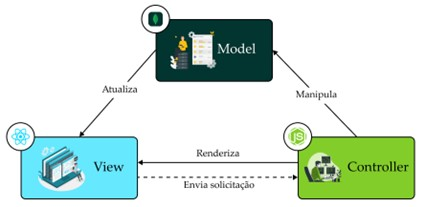
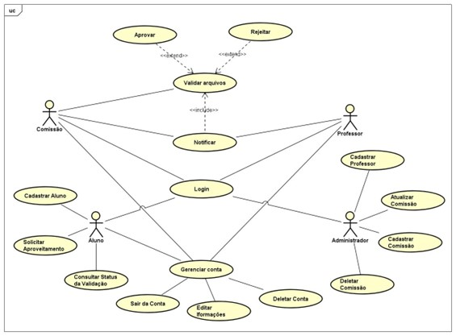
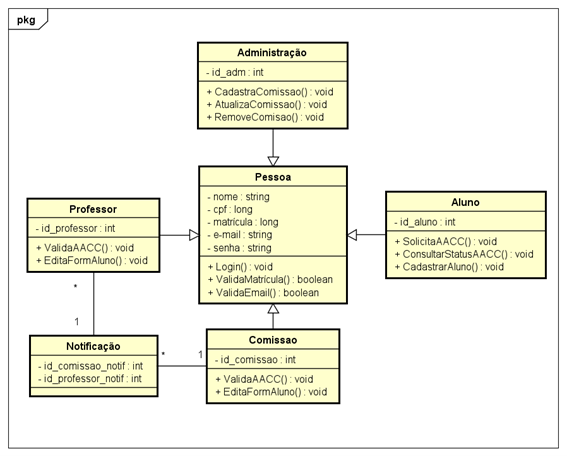
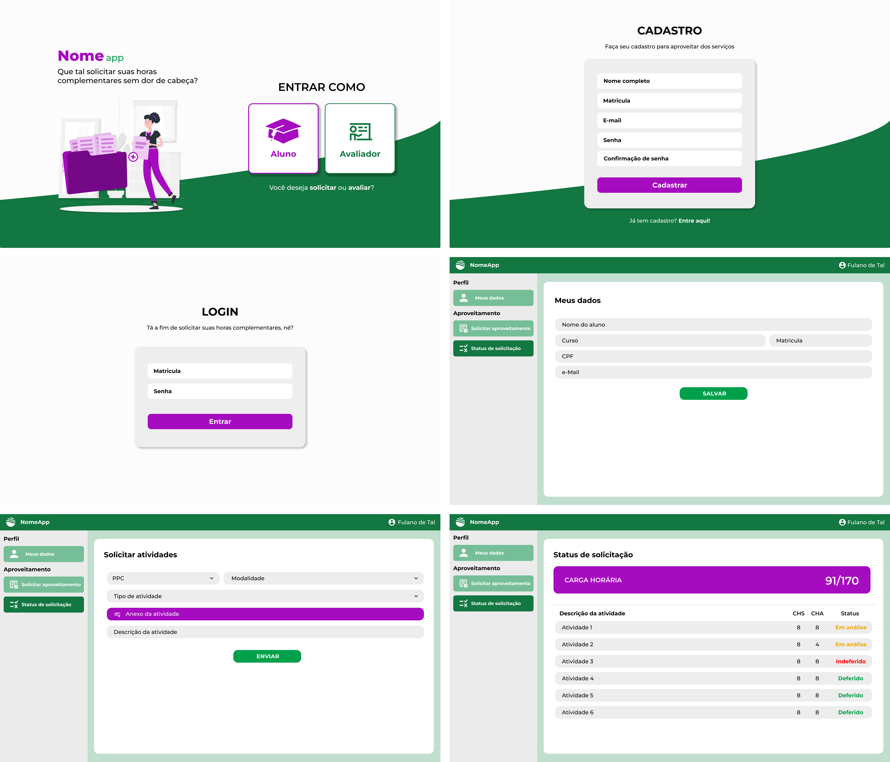

# Sumário
- [Sobre o Documento](https://github.com/IanoMaciel/front-end-aacc#sobre-o-documento)
- [Autores](https://github.com/IanoMaciel/front-end-aacc#autores)
- [Descrição Geral do Sistema](https://github.com/IanoMaciel/front-end-aacc#descri%C3%A7%C3%A3o-geral-do-sistema)
- [Diagrama UML](https://github.com/IanoMaciel/front-end-aacc#diagrama-uml)
- [Protótipo de Alta Fidelidade](https://github.com/IanoMaciel/front-end-aacc#prot%C3%B3tipo-de-alta-fidelidade)
- [Como executar esta aplicação?](https://github.com/IanoMaciel/front-end-aacc#como-executar-esta-aplica%C3%A7%C3%A3o)

# Sobre o Documento
Este documento apresenta uma visão geral da aplicação desenvolvida durante a disciplina Engenharia de Aplicações Web, ministrada no período de 2022/1 pelo Prof. Alternei de Souza Brito.

# Autores
- [Iano Maciel](https://github.com/IanoMaciel)
- [Geise Saunier](https://github.com/GeiseSaunier)
- [Antônio Alberto](https://github.com/antonioalberto-dev)

# Descrição Geral do Sistema
A proposta deste produto é oferecer uma solução para submeter horas relacionadas as Atividades Acadêmico-Científico e Cultural (AACC). A AACC é uma resolução que regulamenta as atividades dos cursos de graduação da Universidade Federal do Amazonas – UFAM e cada curso tem suas características em quantitativos de horas. Para o curso de Bacharelado em Engenharia de Software, por exemplo, o discente deverá obter 170 horas, sendo elas distribuídas em 3 modalidades: ensino, extensão e pesquisa. 

Sabe-se que isto, atualmente, é feito manualmente através do Google Forms, no qual o coordenador do curso o disponibiliza e os discentes submetem suas horas, certificados, entre outros. A proposta desta ferramenta é facilitar o envio desses documentos, além de permitir ao aluno consultar qual modalidade ele necessita concluir para o preenchimento de suas horas. 

Incialmente, a ferramenta será desenvolvida apenas para o curso de Bacharelado em Engenharia de Software, como nota final para a disciplina Engenharia de Aplicações Web. Entretanto, a aplicação será open-source e ficará disponível para que pessoas interessadas em expandir para outros cursos da UFAM consigam acessar e implementar as funcionalidades essenciais para o funcionamento deste.

## Descrição dos Atores

O sistema apresenta 4 atores, sendo esses usuários diferenciados pelas funcionalidades específicas de cada um: Aluno, Comissão, Professor e Administrador. 

**Aluno:** este usuário poderá realizar o cadastro de suas informações utilizando os seguintes dados de matrícula institucional: nome completo, telefone e e-mail. Ele poderá submeter aproveitamento de horas enviando um documento comprobatório (certificado autenticado, declaração) e especificando sua modalidade (ensino, extensão e pesquisa).

**Comissão:** a comissão de avaliação de AACC é constituída por até 4 (quatro) docentes do curso, nomeados pelo colegiado deste com mandato de 2 (dois) anos renováveis por igual período. O ator comissão é responsável por autenticar as horas enviadas pelos alunos, além de ter a possibilidade de editar qualquer campo do formulário e encaminhar para o ator Professor caso seja necessário a autenticação dele. 

**Professor:**  Este ator poderá realizar a validação de horas se, e somente se, o ator Comissão notificá-lo. Caso contrário, ele poderá deferir ou indeferir a solicitação de aproveitamento de horas enviada pelo aluno.
Administrador: Responsável por cadastrar, remover e atualizar dados da Comissão.

## Arquitetura de Software
Esta seção descreve as características da arquitetura utilizada no desenvolvimento do Uni+. Para tal, foi adotada a MVC, sendo está descrita abaixo

### Estrutura MVC aplicada ao sistema UNI+

**Camada Model**

Essa camada conterá todas as interações necessárias para integrar o banco de dados MondoDB com os objetos da view através do controller, onde separa todo tipo de  linguagem padrão de banco de dados, da camada view. 

**Camada View**

Essa camada conterá todas as interfaces visuais, na qual o aluno interagirá diretamente com os demais usuários do sistema. Sendo subdividida em:  
- Visual: contém a página Web, os formulários, e as informações necessárias para o aproveitamento de horas complementares.
- Controles: Contém todos os códigos necessários para comunicação entre a camada de controller ou model, com a página Web (Ajax).

**Camada Controller**

Essa camada conterá os controladores necessários para interação da camada View com a camada model. Esses controladores servem como intermediários entre as duas outras camadas. A interação deve ser realizada quando houver uma aquisição da camada view.



# Diagrama UML
## Caso de Uso


## Diagrama de Classe


# Protótipo de Alta Fidelidade


# Como executar esta aplicação?
Para a executar esta aplicação basta seguir os passos abaixo:

1. Clone este repositório:

```
    https://github.com/IanoMaciel/front-end-aacc
```

2. No terminal, utilize "cd front-end-aacc" para entrar no diretório. Em seguida, utilize o comando a seguir para instalar as dependências:


```
yarn i
```
ou

```
npm install
```

3. Por fim, utilize o comando ```yarn dev``` ou ```npm dev``` para executar a aplicação
